# Description
PoC with Vault, Vault Agent and key/value secrets management.

## Start Vault as Docker service in development mode

In this mode Vault only save configurations and secrets in memory. Only use this mode for some checks:

```
docker run --name vault -d --cap-add=IPC_LOCK -e VAULT_DEV_ROOT_TOKEN_ID=root -p 8200:8200 vault
```

export url and root token environments:

```
export VAULT_ADDR='http://0.0.0.0:8200'
export VAULT_TOKEN=root
```

## Start Vault as Docker service in production mode

This runs a Vault server with TLS disabled, the file storage backend at path /vault/file and a default secret lease duration of one week and a maximum of 30 days. Disabling TLS and using the file storage backend are not recommended for production use.

```
docker run --name vault -d --cap-add=IPC_LOCK -e 'VAULT_LOCAL_CONFIG={"storage": {"file": {"path": "/vault/file"}}, "listener": [{"tcp": { "address": "0.0.0.0:8200", "tls_disable": true}}], "default_lease_ttl": "168h", "max_lease_ttl": "720h", "ui": true}' -p 8200:8200 vault server
```

export url and root token environments generated after configuration (json tokens file downloaded)

```
export VAULT_ADDR='http://0.0.0.0:8200'
export VAULT_TOKEN=hvs.fwEWVE5LwluMEe9lmqvnqhBi
```

## Vault login

We can login in vault if we not export the VAULT_TOKEN environment variable:

```
export VAULT_ADDR='http://0.0.0.0:8200'

vault login <ROOT_TOKEN>
```

the root token could be generated in production mode or fix in development mode as previous

## Check Vault service

Check vault status

```
vault status

Key             Value
---             -----
Seal Type       shamir
Initialized     true
Sealed          false
Total Shares    1
Threshold       1
Version         1.13.0
Build Date      2023-03-01T14:58:13Z
Storage Type    inmem
Cluster Name    vault-cluster-35964baf
Cluster ID      da5425e5-f11a-e97e-2ebb-2de0169ba90f
HA Enabled      false
```

## Access to Vault UI

Go to vault root http uri:
```
http://localhost:8200/
```

Now configure vault ui production mode the first time in 4 steps

**STEP01: Configure root keys in emergency case. Set 1 and 1 in both attributes**

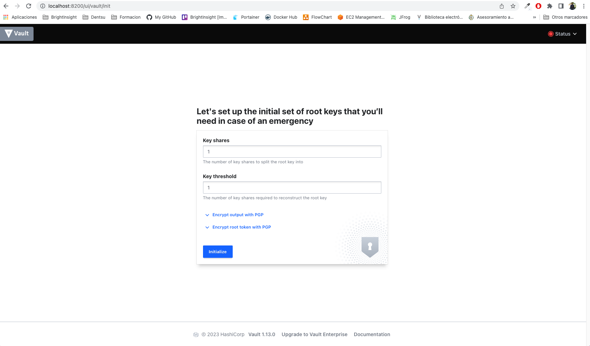

**STEP02: The system create for us two keys. This keys will be used to login in UI later. We can download**

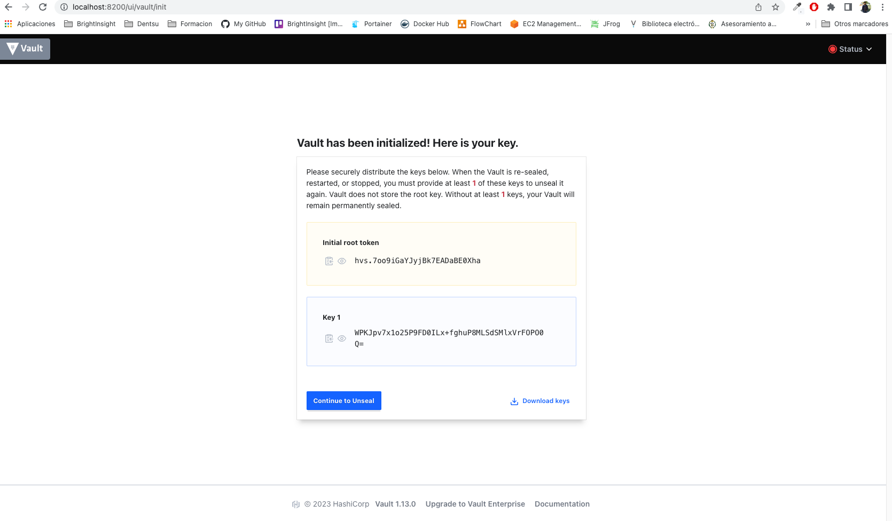

**STEP03: Now continue with the Unseal configuration**

We must introduce the Key 1 created previously to finish the configuration

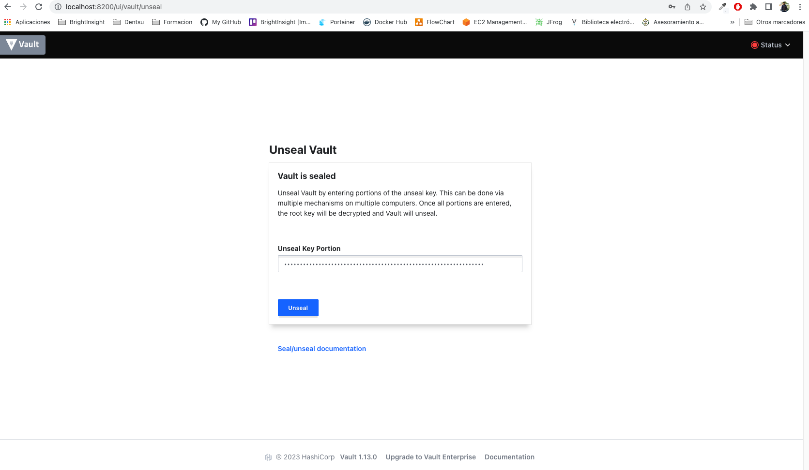

**STEP04: We can login using the root key created for us**

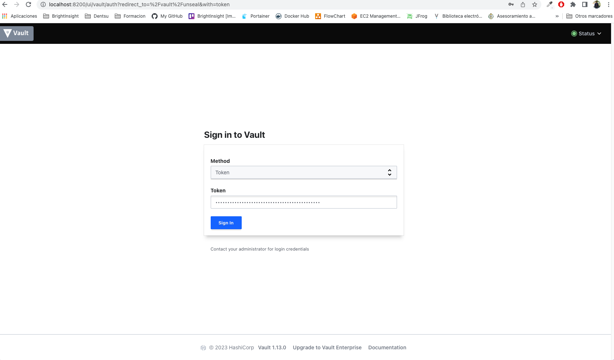

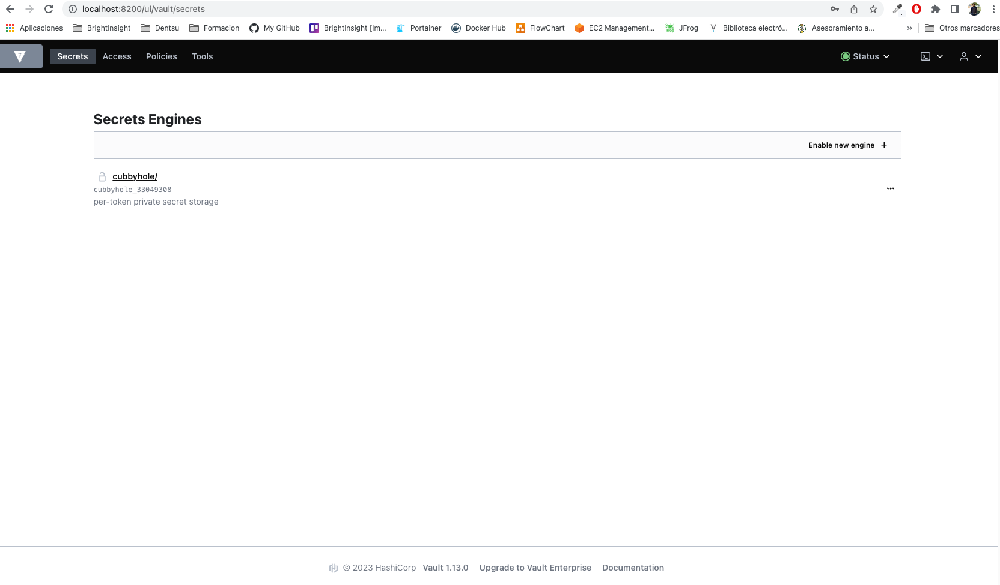

The next times we can access using root toke to autenticate as root. Is the system is stopped we must unselad agaun using the other token

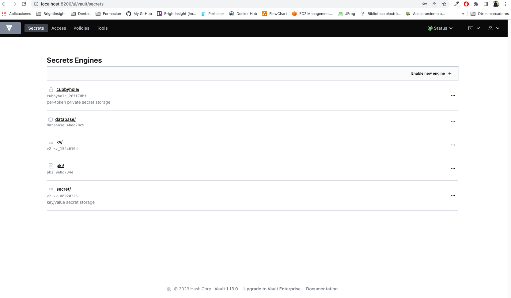

## Manage access methods in Vault

By default vault only activate the token access. We will activate the username/password method and create a new account for this method.

From Access Menu option click the button Enabled new method

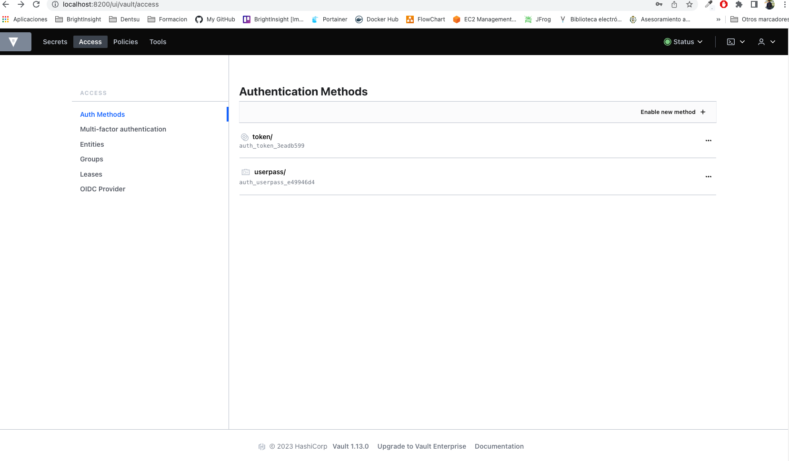

Select Username& Passrod option and click Next

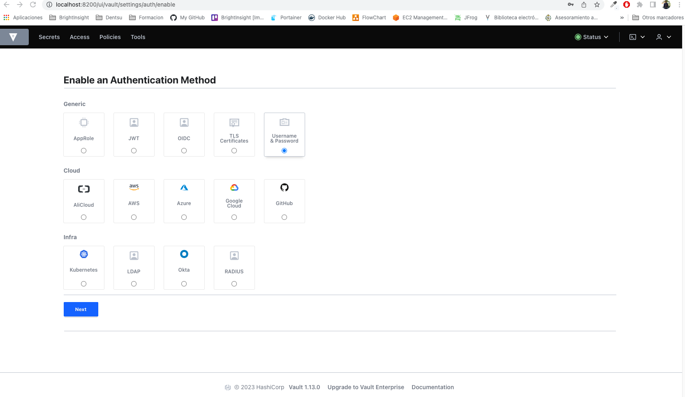

The new access method is showed in this list

## Manage accounts inside access methods in Vault

Select the username/password access method and create a new account clicking in Create user

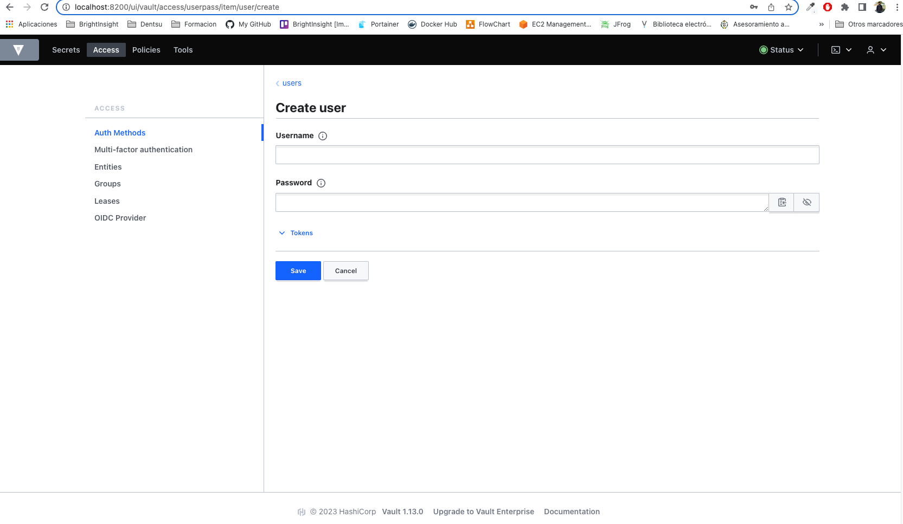

The new account is showed in the list of this method

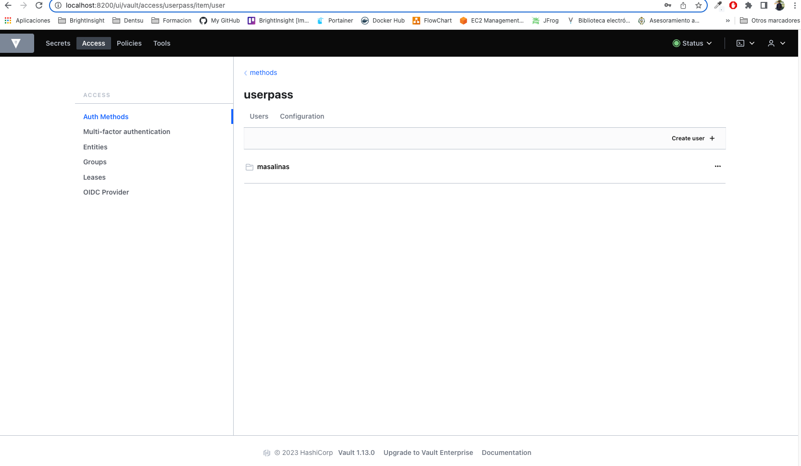

Login with the new account using the username/password method

```
vault login -method=userpass username=masalinas password=password
```

## Manage vault agent

**STEP01: Write a Agant Policy**:

```
vault policy write agent agent.hcl
```

Where agent.hcl define the policies to have total access to any path inside kv secrets engine

```
path "kv/data/agent/*"
{
  capabilities = ["create", "read", "update", "delete", "list"]
}
```

**STEP02: Enable the kv secrets engine**:

```
vault secrets enable -version=2 kv
```

**STEP03: Store a sample secret**:

```
vault kv put kv/agent/static app=agent username=agent password=sup4s3cr3t
```

Revover the secret

```
vault kv get kv/agent/static
```

**STEP04: Enable AppRole Access**:

```
vault auth enable approle
```

**STEP05: Create a role called agent attached to the policy callee agend previously created**:

```
vault write auth/approle/role/agent policies="agent"
```


**STEP06: Obtain a Role ID and Secret Id from role agent to authenticate the Vault Agent**:

```
vault read -format=json auth/approle/role/agent/role-id \
  | jq -r '.data.role_id' > vault-agent/agent-role_id

vault write -format=json -f auth/approle/role/agent/secret-id \
  | jq -r '.data.secret_id' > vault-agent/agent-secret_id
```

**STEP07: Start vault agent from configuration**:

```
vault agent -log-level debug -config=./vault-agent/agent-vault-agent.hcl
```

**STEP08: Watch results**:

After Vault Agent starts, this service will get the secrets configured in the template and create a simple htlm templat for then:


**STEP09: Rotate some secrets and show the results**

Now we are going to change (rotate) from attributes in the secret and the agent will get it again and refresh our html template. To rotate a secret we will create a new version of our secret and change some particular attribute, for example the username

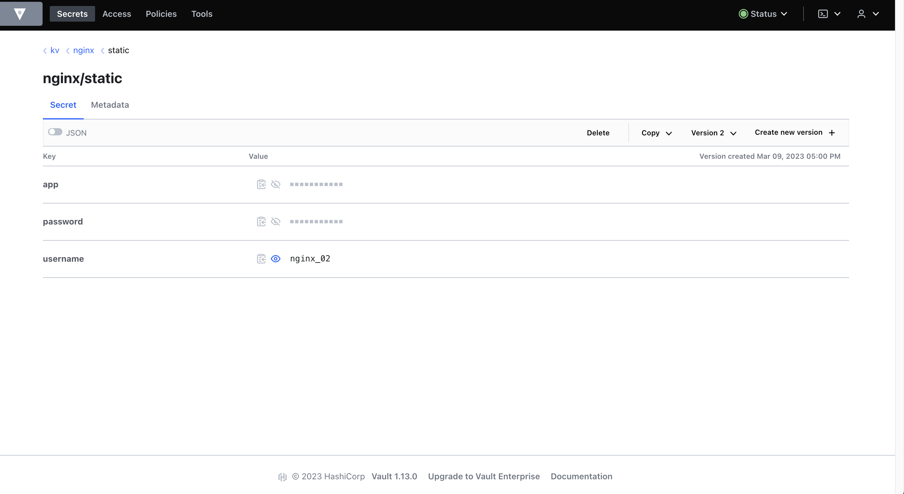

When save this new version secret, the agent will detect this change and download the secrets again and execute the template creating a new one with the changes:

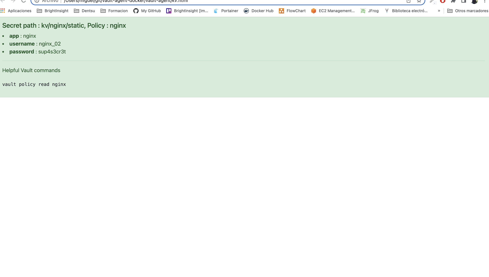

## Some links

[Vault Docker Reference](https://hub.docker.com/_/vault)

[Vault Agant Sample](https://sleeplessbeastie.eu/2022/10/17/how-to-install-vault-agent)