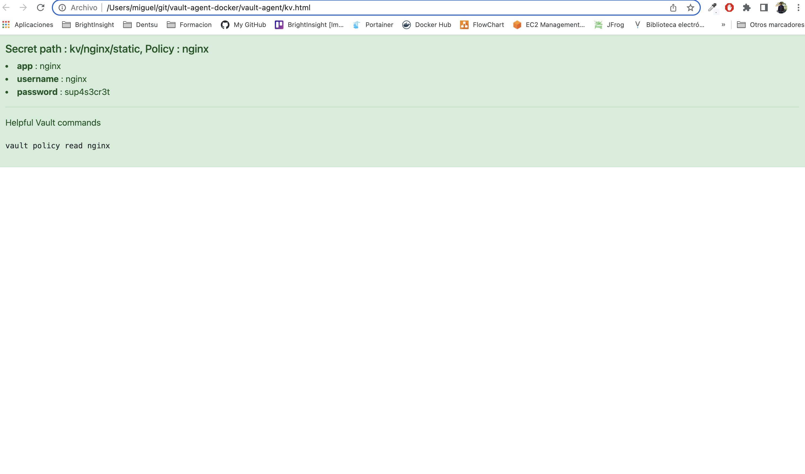

# Description
PoC with Vault, Vault Agent and key/value secrets management.

## Start Vault as Docker service in development mode

In this mode Vault only save configurations and secrets in memory. Only use this mode for some checks:

```
docker run --name vault -d --cap-add=IPC_LOCK -e VAULT_DEV_ROOT_TOKEN_ID=root -p 8200:8200 vault
```

export url and root token environments:

```
export VAULT_ADDR='http://0.0.0.0:8200'
export VAULT_TOKEN=root
```

## Start Vault as Docker service in production mode

This runs a Vault server with TLS disabled, the file storage backend at path /vault/file and a default secret lease duration of one week and a maximum of 30 days. Disabling TLS and using the file storage backend are not recommended for production use.

```
docker run --name vault -d --cap-add=IPC_LOCK -e 'VAULT_LOCAL_CONFIG={"storage": {"file": {"path": "/vault/file"}}, "listener": [{"tcp": { "address": "0.0.0.0:8200", "tls_disable": true}}], "default_lease_ttl": "168h", "max_lease_ttl": "720h", "ui": true}' -p 8200:8200 vault server
```

export url and root token environments generated after configuration (json tokens file downloaded)

```
export VAULT_ADDR='http://0.0.0.0:8200'
export VAULT_TOKEN=hvs.fwEWVE5LwluMEe9lmqvnqhBi
```

## Vault login

We can login in vault if we not export the VAULT_TOKEN environment variable:

```
export VAULT_ADDR='http://0.0.0.0:8200'

vault login <ROOT_TOKEN>
```

the root token could be generated in production mode or fix in development mode as previous

## Check Vault service

Check vault status

```
vault status

Key             Value
---             -----
Seal Type       shamir
Initialized     true
Sealed          false
Total Shares    1
Threshold       1
Version         1.13.0
Build Date      2023-03-01T14:58:13Z
Storage Type    inmem
Cluster Name    vault-cluster-35964baf
Cluster ID      da5425e5-f11a-e97e-2ebb-2de0169ba90f
HA Enabled      false
```

## Access to Vault UI

Go to vault root http uri:
```
http://localhost:8200/
```

Now configure vault ui production mode the first time in 4 steps

**STEP01** : Configure root keys in emergency case. Set 1 and 1 in both attributes


**STEP02** : The system create for us two keys. This keys will be used to login in UI later. We can download

- intial root token: hvs.7oo9iGaYJyjBk7EADaBE0Xha
- Key 1: 58f289a6fef1d68db93fd143d082f1f9f821b8ff0c2d2752325c55ac538f3b44


**STEP03**: Now continue with the Unseal configuration

We must introduce the Key 1 created previously to finish the configuration


**STEP04**: We can login using the root key created for us


The next times we can access using toke authentication method and the token VAULT_TOKEN or VAULT_DEV_ROOT_TOKEN_ID defined:


## Manage access methods in Vault

By default vault only activate the token access. We are activate the username/password access and create a new account for this new type

From Access Menu option click the button Enabled new method


Select Username& Passrod option and click Next


The new access method is showed in this list

## Manage accounts inside access methods in Vault

select the username/password access method and create a new account cliking in Create user


the new account is showed in the list of this method


Login with the new accound

```
vault login -method=userpass username=masalinas password=password
```

## Manage vault agent

**STEP01 Write a Agant Policy**:
vault policy write agant agent.hcl

where agent.hcl define the policied to have toal access to any path inside kv agant path

```
path "kv/data/agent/*"
{
  capabilities = ["create", "read", "update", "delete", "list"]
}
```

**STEP02 Enable the kv Secrets engine and store a secret**:

```
vault secrets enable -version=2 kv
```

**STEP03 store a sample secret**:

```
vault kv put kv/agent/static app=agent username=agent password=sup4s3cr3t
```

Revover the secret

```
vault kv get kv/agent/static
```

**STEP04 Enable AppRole and create a role**:

```
vault auth enable approle
```

**STEP05 create a role called agent attached to agent policy previous created**:

```
vault write auth/approle/role/agent policies="agent"
```


**STEP06 Write out a Role ID and Secret ID**:

```
vault read -format=json auth/approle/role/agent/role-id \
  | jq -r '.data.role_id' > vault-agent/agent-role_id

vault write -format=json -f auth/approle/role/agent/secret-id \
  | jq -r '.data.secret_id' > vault-agent/agent-secret_id
```

**STEP07 Start vault agent**:

```
vault agent -log-level debug -config=./vault-agent/agent-vault-agent.hcl
```

**STEP08 Watch results**:

After Vault Agent starts, this service got the secrets configured in the template and create a simple htlm showing these secrets recovered:



**STEP09: Rotate some secrets and show the results**

Now we are going to change (rotate) from secret and the agent will get it again and refresh our html. To rotate a secret we will create a new version of ours secrets and change some one for example the username


When save this new version the agent will detect this change and download the secret again and execute the template creating a new html with this change:


## Some links

[Vault Docker Reference](https://hub.docker.com/_/vault)

[Vault Agant Sample](https://sleeplessbeastie.eu/2022/10/17/how-to-install-vault-agent)